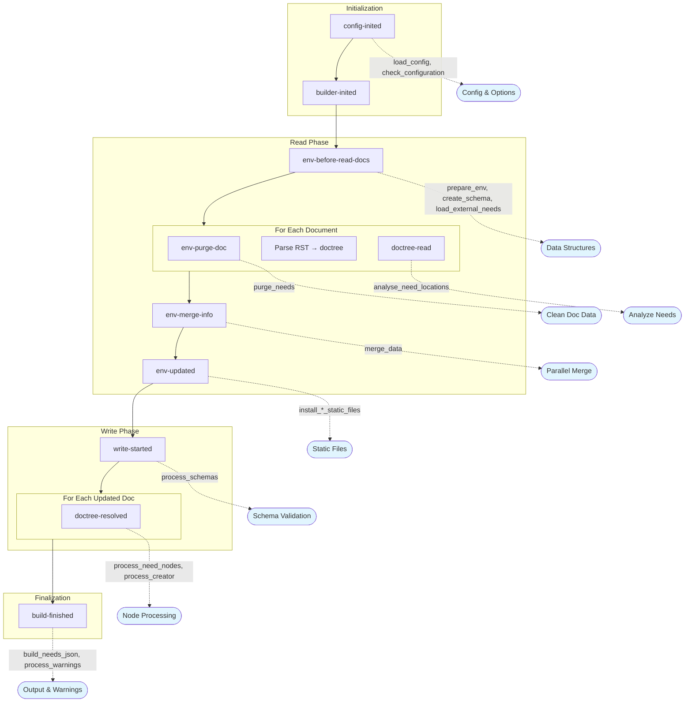

# AGENTS.md

This file provides guidance for AI coding agents working on the **Sphinx-Needs** repository.

## Project Overview

Sphinx-Needs is a Sphinx extension for managing needs/requirements and specifications in documentation. It allows definition, linking, and filtering of class-like need-objects (requirements, specifications, implementations, test cases, etc.).

## Repository Structure

```
pyproject.toml        # Project configuration and dependencies

sphinx_needs/          # Main source code
├── api/               # Public API
├── directives/        # Sphinx directives (need, needtable, needflow, etc.)
├── functions/         # Dynamic functions
├── roles/             # Sphinx roles
├── services/          # External services (GitHub, OpenNeeds)
├── nodes/             # Docutils nodes
└── ...

tests/                 # Test suite
├── doc_test/          # Test documentation projects
├── js_test/           # Cypress JavaScript tests
├── benchmarks/        # Performance benchmarks
├── __snapshots__/     # Syrupy snapshot files
└── ...

docs/                  # Documentation source (RST files)
```

## Development Commands

All commands should be run via [`tox`](https://tox.wiki) for consistency. The project uses `tox-uv` for faster environment creation.

### Testing

```bash
# Run all tests (excluding benchmarks)
tox -- tests/

# Run a specific test file
tox -- tests/test_basic_doc.py

# Run a specific test function
tox -- tests/test_basic_doc.py::test_function_name

# Run tests with a specific Python version
tox -e py312 -- tests/

# Update snapshot tests (syrupy)
tox -- tests/ --snapshot-update

# Run benchmark tests
tox -e py312-benchmark -- tests/benchmarks/
```

### Documentation

```bash
# Build docs with furo theme (clean build)
CLEAN=true tox -e docs-furo

# Rebuild docs (incremental)
tox -e docs-furo

# Build with different themes
tox -e docs-alabaster
tox -e docs-rtd
tox -e docs-pds
tox -e docs-im

# Check documentation links
BUILDER=linkcheck tox -e docs-furo
```

### Code Quality

```bash
# Type checking with mypy
tox -e mypy

# Linting with ruff (auto-fix enabled)
tox -e ruff-check

# Formatting with ruff
tox -e ruff-fmt

# Run pre-commit hooks on all files
pre-commit run --all-files
```

## Code Style Guidelines

- **Formatter/Linter**: Ruff (configured in `pyproject.toml`)
- **Type Checking**: Mypy with strict mode (configured in `pyproject.toml`)
- **Docstrings**: Use Sphinx-style docstrings (not Google or NumPy style)
- **Function Signatures**: Use `/` and `*` to enforce positional-only and keyword-only arguments where appropriate

### Best Practices

- **Type annotations**: Use strict typing throughout. All function signatures should have complete type annotations. Use `TypedDict` for structured dictionaries, `Protocol` for duck typing.
- **Immutability**: Prefer immutable data structures. Needs are "sealed" (made immutable) after post-processing to prevent accidental modification.
- **Pure functions**: Where possible, write pure functions without side effects. This makes code easier to test and reason about.
- **Avoid global state**: Pass dependencies explicitly rather than relying on global variables.
- **Error handling**: Use specific exception types from `sphinx_needs.errors`. Provide helpful error messages with context.
- **Logging**: Use `sphinx_needs.logging.get_logger(__name__)` for logging. Use `log_warning()` for user-facing warnings.

### Docstrings

The Sphinx-style docstring format should be used throughout the codebase.
Types are not required in docstrings as they should be handled by type hints.

Example:

```python
def process_need(
    need_id: str,
    /,
    *,
    status: str | None = None,
) -> dict[str, str]:
    """Process a need and return its data.

    :param need_id: The unique identifier of the need.
    :param status: Optional status filter.
    :return: Dictionary containing need data.
    :raises ValueError: If need_id is not found.
    """
    ...
```

## Testing Guidelines

### Test Structure

- Tests use `pytest` with fixtures defined in `tests/conftest.py`
- Test documentation projects are in `tests/doc_test/`
- Snapshot testing uses `syrupy` - update snapshots with `--snapshot-update`
- JavaScript tests use Cypress and require the `@pytest.mark.jstest` marker

### Writing Tests

1. Create a test documentation project in `tests/doc_test/` if needed
2. Use the `test_app` fixture for Sphinx application testing
3. Mark tests appropriately:
   - `@pytest.mark.jstest` - JavaScript/Cypress tests
   - `@pytest.mark.benchmark` - Performance benchmarks
   - `@pytest.mark.fixture_file` - Tests using fixture files

### Test Best Practices

- **Test coverage**: Write tests for all new functionality and bug fixes
- **Isolation**: Each test should be independent and not rely on state from other tests
- **Descriptive names**: Test function names should describe what is being tested and expected outcome
- **Snapshot testing**: Use syrupy snapshots for complex HTML/output comparisons; review snapshot changes carefully
- **Edge cases**: Test error conditions, empty inputs, and boundary cases
- **Parametrization**: Use `@pytest.mark.parametrize` to test multiple scenarios with the same test logic

### Example Test Pattern

```python
import pytest

@pytest.mark.parametrize(
    "test_app",
    [{"buildername": "html", "srcdir": "doc_test/doc_basic"}],
    indirect=True,
)
def test_example(test_app):
    app = test_app
    app.build()
    # Assert on build results
```

## Pull Request Requirements

When submitting changes:

1. **Description**: Meaningful description or link explaining the change
2. **Tests**: Include test cases for new functionality or bug fixes
3. **Documentation**: Update docs if behavior changes or new features are added
4. **Changelog**: Update `docs/changelog.rst`
5. **Code Quality**: Ensure `tox -e ruff-check` and `tox -e mypy` pass

## Key Files

- `pyproject.toml` - Project configuration, dependencies, and tox config
- `sphinx_needs/needs.py` - Main extension setup and event registration
- `sphinx_needs/config.py` - Configuration options via `NeedsSphinxConfig` class (centralizes all `needs_*` config values)
- `sphinx_needs/data.py` - Data structures (`SphinxNeedsData`, `NeedsInfoType`, etc.) for storing and accessing needs
- `sphinx_needs/directives/` - All directive implementations
- `tests/conftest.py` - Test fixtures and configuration

### Configuration (`sphinx_needs/config.py`)

The `NeedsSphinxConfig` class centralizes all Sphinx-Needs configuration options.
It:

- Defines all `needs_*` configuration values with their types and defaults
- Provides type-safe access to configuration throughout the codebase
- Handles configuration validation and conversion

### Data Interfaces (`sphinx_needs/data.py`)

This module defines the core data structures:

- `SphinxNeedsData` - Main interface for accessing/storing needs data in the Sphinx environment
- `NeedsInfoType` - TypedDict defining the structure of a single need
- `NeedsCoreFields` - Core field definitions (id, title, status, etc.)
- `merge_data()` - Handles merging data from parallel builds

### Schema Classes (`sphinx_needs/needs_schema.py`)

This module defines the schema data structures that serve as the single source of truth for field and link definitions:

- `FieldSchema` - Immutable dataclass defining a single field's schema, including:
  - `name`, `description`, `schema` (JSON Schema type/constraints)
  - `nullable`, `directive_option`, `parse_dynamic_functions`, `parse_variants`
  - `allow_defaults`, `allow_extend`, `default`, `predicate_defaults`
  - Methods: `convert_directive_option()`, `type_check()`, `json_schema()`

- `LinkSchema` - Immutable dataclass for link fields with similar structure to `FieldSchema`

- `FieldsSchema` - Container class holding all field schemas:
  - `get_core_field(name: str) -> FieldSchema | None`
  - `get_extra_field(name: str) -> FieldSchema | None`
  - `get_link_field(name: str) -> LinkSchema | None`
  - other iteration and access methods

The schema is built during `env-before-read-docs` via the `create_schema()` function in `sphinx_needs/needs.py`.
It creates `FieldSchema` and `LinkSchema` from information obtained from the `NeedsCoreFields` and from user defined configuration.
Once built, the schema is immutable for the rest of the build.
It is accessible via `SphinxNeedsData(env).get_schema()`.

## Sphinx Extension Architecture

The extension integrates with Sphinx via event callbacks registered in the `setup()` function in `sphinx_needs/needs.py`. Understanding the Sphinx build flow is essential for contributing to this project.

### Sphinx Build Flow Overview

```
1. config-inited(app, config)      # Configuration loaded
2. builder-inited(app)             # Builder created
3. env-get-outdated(...)           # Determine changed files
4. env-before-read-docs(...)       # Before reading documents
   └── For each document:
       5. env-purge-doc(...)       # Clean old data
       6. source-read(...)         # Read source file
       7. Parse source → doctree
       8. Apply transforms
       9. doctree-read(...)        # Doctree parsed
10. env-merge-info(...)            # Merge parallel data
11. env-updated(...)               # All docs read
12. env-check-consistency(...)     # Consistency checks
13. write-started(...)             # Before writing output
    └── For each updated doc:
        14. Apply post-transforms
        15. doctree-resolved(...)  # References resolved
16. Generate output files
17. build-finished(...)            # Build complete
```

### How Sphinx-Needs Hooks Into the Sphinx Build

The extension is principally structured around the Sphinx build lifecycle.
The extension is initialised in the `setup()` function in `sphinx_needs/needs.py`.
In this function, the extension registers callbacks at strategic points in this flow:



#### Configuration Resolution Phase (`config-inited`)

```python
app.connect("config-inited", load_config_from_toml, priority=10)  # Load TOML config
app.connect("config-inited", load_config)                         # Register extra fields/directives
app.connect("config-inited", merge_default_configs)               # Merge defaults
app.connect("config-inited", check_configuration, priority=600)   # Validate config
```

#### Environment Setup (`env-before-read-docs`)

```python
app.connect("env-before-read-docs", prepare_env)           # Initialize data structures
app.connect("env-before-read-docs", create_schema)         # Create validation schema
app.connect("env-before-read-docs", resolve_schemas_config). # Validates schema definitions and inject type information
app.connect("env-before-read-docs", load_external_needs)   # Load external need files
```

The `prepare_env` function initializes `BuildEnvironment` variables, registers services (GitHub, OpenNeeds), registers dynamic functions, initializes extra fields and links, and optionally starts process timing.

#### Document Processing

```python
app.connect("env-purge-doc", purge_needs)          # Clean need data for changed docs
app.connect("doctree-read", analyse_need_locations) # Analyze need positions in doctree
app.connect("env-merge-info", merge_data)          # Merge data from parallel processes
```

- `purge_needs`: Removes all cached need items originating from removed/changed documents
- `analyse_need_locations`: Determines parent sections for needs, removes `Need` nodes marked as `hidden`

#### Static Files and Styling (`env-updated`)

```python
app.connect("env-updated", install_lib_static_files)
app.connect("env-updated", install_permalink_file)
app.connect("env-updated", install_styles_static_files)
```

Note: These callbacks are skipped for the `needs` builder (which only outputs JSON).

#### Output Generation (`doctree-resolved`)

```python
app.connect("doctree-resolved", process_creator(NODE_TYPES_PRIO), priority=100)
app.connect("doctree-resolved", process_need_nodes)   # Process Need nodes
app.connect("doctree-resolved", process_creator(NODE_TYPES))  # Process all other nodes
```

The `doctree-resolved` event is where node processing happens. `process_need_nodes` removes `Needextend` nodes and formats each `Need` node for visual output. `process_creator` converts other custom nodes (`Needtable`, `Needflow`, `Needlist`, etc.) to standard docutils nodes.

#### Write Phase (`write-started`)

```python
app.connect("write-started", process_schemas)              # Process schema validations
app.connect("write-started", ensure_post_process_needs_data)  # Finalize needs data
```

The `ensure_post_process_needs_data` function calls `post_process_needs_data`, which performs the key data processing operations in order:

1. `extend_needs_data` - Apply all `needextend` modifications to need data
2. `resolve_functions` - Resolve dynamic function values (calls functions set as field values)
3. `update_back_links` - Generate back-links and check for dead/broken links between needs
4. `process_constraints` - Process constraints for each need

After this, needs are "sealed" (made immutable) via the `needs-before-sealing` event.

#### Finalization (`build-finished`)

```python
app.connect("build-finished", process_warnings)     # Emit warnings
app.connect("build-finished", build_needs_json)     # Generate needs.json
app.connect("build-finished", build_needs_id_json)  # Generate needs ID file
app.connect("build-finished", build_needumls_pumls) # Generate PlantUML files
```

- `process_warnings`: Runs user-defined need data checks from `needs_warnings` config
- `build_needs_json`: Writes `needs.json` if `needs_build_json = True`
- `build_needs_id_json`: Writes per-ID JSON files if `needs_build_json_per_id = True`
- `build_needumls_pumls`: Writes UML files if `needs_build_needumls = True`

### Custom Events

Sphinx-Needs also defines its own events that extensions can hook into:

```python
app.add_event("needs-before-post-processing")  # Before needs post-processing
app.add_event("needs-before-sealing")          # Before needs are sealed (made immutable)
```

### Key Data Flow

1. **Directives** (e.g., `NeedDirective`) parse RST/MyST and create docutils nodes
2. **Nodes** (e.g., `Need`, `Needtable`) store structured data in the doctree
3. **SphinxNeedsData** (`sphinx_needs/data.py`) stores all needs in `env.needs_all_needs`
4. **Processing functions** convert custom nodes to standard HTML/LaTeX during `doctree-resolved`
5. **Builders** (e.g., `NeedsBuilder`) can generate specialized output formats

### Reference Documentation

- [Sphinx Event Callbacks](https://www.sphinx-doc.org/en/master/extdev/event_callbacks.html)
- [Extending Sphinx Syntax](https://www.sphinx-doc.org/en/master/development/tutorials/extending_syntax.html)
- [Extending Sphinx Build](https://www.sphinx-doc.org/en/master/development/tutorials/extending_build.html)

## Common Patterns

### Adding a New Directive

1. Create directive class in `sphinx_needs/directives/`
2. Register in `sphinx_needs/needs.py`
3. Add documentation in `docs/directives/`
4. Add tests in `tests/test_<directive_name>.py`

### Adding a Configuration Option

1. Add to `sphinx_needs/config.py`
2. Document in `docs/configuration.rst`
3. Add tests for the new option

## Debugging

- Build docs with `-T` flag for full tracebacks (default in tox)
- Use `sphinx_needs.debug` module for debugging utilities
- Check `docs/_build/` for build outputs
- Enable `needs_debug_measurement = True` to profile build performance
