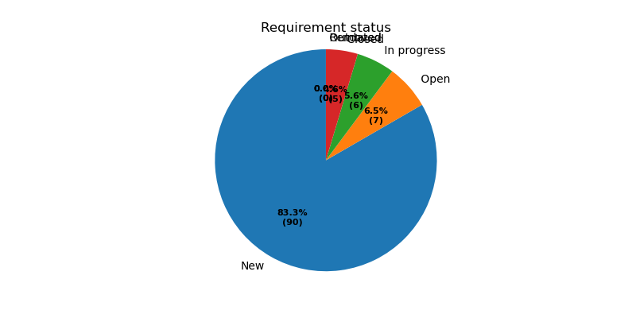

.. _needpie:

needpie
========

.. versionadded:: 0.5.0

``needpie`` adds a pie-chart to your documentation.

|ex|

.. code-block:: rst

   .. needpie:: My pie chart

      type == 'req'
      type == 'spec'
      10

|out|

.. needpie:: My pie chart

   type == 'req'
   type == 'spec'
   10

If you provide an argument for the ``needpie``, we use it as the title.

Each content line gets interpreted either as static float/int value or as a :ref:`filter_string`.
The amount of found needs by the filter string is then used as value.

You can use :ref:`filter_func` with Python codes to define custom filters for ``needpie``.

Options
-------

**Example with all options used:**

.. code-block:: rst

   .. needpie:: Requirement status
      :labels: Open, In progress, Closed
      :legend:
      :shadow:
      :explode: 0, 0.3, 0
      :colors: #ffcc00, #444444, limegreen
      :text_color: crimson
      :style: dark_background

      type == 'req' and status == 'open'
      type == 'req' and status == 'in progress'
      type == 'req' and status == 'closed'

|out|

.. needpie:: Requirement status
   :labels: Open, In progress, Closed
   :legend:
   :shadow:
   :explode: 0, 0.3, 0
   :colors: #ffcc00, #444444, limegreen
   :text_color: crimson
   :style: dark_background

   type == 'req' and status == 'open'
   type == 'req' and status == 'in progress'
   type == 'req' and status == 'closed'

labels
~~~~~~

Use ``:labels:`` to set labels for each value.

``:labels:`` must get a comma separated string and the amount of labels must match the amount of
values/lines from content.

|ex|

.. needpie:: Requirement status
   :labels: Open, In progress, Closed

   type == 'req' and status == 'open'
   type == 'req' and status == 'in progress'
   type == 'req' and status == 'closed'

|out|

.. code-block:: rst

   .. needpie:: Requirement status
      :labels: Open, In progress, Closed

      type == 'req' and status == 'open'
      type == 'req' and status == 'in progress'
      type == 'req' and status == 'closed'

legend
~~~~~~

You can place a legend on the right side of the pie chart by setting the ``:legend:`` flag.

The ``:legend:`` flag does not support any values.

|ex|

.. needpie:: Requirement status
   :labels: Open, In progress, Closed
   :legend:

   type == 'req' and status == 'open'
   type == 'req' and status == 'in progress'
   type == 'req' and status == 'closed'

|out|

.. code-block:: rst

   .. needpie:: Requirement status
      :labels: Open, In progress, Closed
      :legend:

      type == 'req' and status == 'open'
      type == 'req' and status == 'in progress'
      type == 'req' and status == 'closed'

explode
~~~~~~~

``:explode:`` takes a comma-separated list of floats and defines how much space a specific pie-part
moves of from center.

The amount of values for ``:explode:`` must match the amount of values / content lines.

Useful values for ``:explode:`` are between ``0`` and ``0.3``

|ex|

.. needpie:: Requirement status
   :explode: 0,0.2,0

   type == 'req' and status == 'open'
   type == 'req' and status == 'in progress'
   type == 'req' and status == 'closed'

|out|

.. code-block:: rst

   .. needpie:: Requirement status
      :explode: 0,0.2,0

      type == 'req' and status == 'open'
      type == 'req' and status == 'in progress'
      type == 'req' and status == 'closed'

shadow
~~~~~~

``:shadow:`` activates a shadow in the pie chart. It does not support any further values.

|ex|

.. needpie:: Requirement status
   :explode: 0,0.2,0
   :shadow:

   type == 'req' and status == 'open'
   type == 'req' and status == 'in progress'
   type == 'req' and status == 'closed'

|out|

.. code-block:: rst

   .. needpie:: Requirement status
      :explode: 0,0.2,0
      :shadow:

      type == 'req' and status == 'open'
      type == 'req' and status == 'in progress'
      type == 'req' and status == 'closed'

colors
~~~~~~

``:color:`` takes a comma separated list of color names and uses them for the pie pieces.

See `Matplotlib documentation of supported colors <https://matplotlib.org/stable/gallery/color/named_colors.html>`_
for a complete list of color names.

But besides names, the ``:colors:`` option also supports hex-values like ``#ffcc00``.

|ex|

.. needpie:: Requirement status
   :colors: lightcoral, gold, #555555

   type == 'req' and status == 'open'
   type == 'req' and status == 'in progress'
   type == 'req' and status == 'closed'

|out|

.. code-block:: rst

   .. needpie:: Requirement status
      :colors: lightcoral, gold, #555555

      type == 'req' and status == 'open'
      type == 'req' and status == 'in progress'
      type == 'req' and status == 'closed'

text_color
~~~~~~~~~~

``:text_color:`` defines the color for text inside the pie pieces and the labels.

.. note:: Setting the ``:text_color:`` option does not change the legend and title color.

|ex|

.. needpie:: Requirement status
   :text_color: w

   type == 'req' and status == 'open'
   type == 'req' and status == 'in progress'
   type == 'req' and status == 'closed'

|out|

.. code-block:: rst

   .. needpie:: Requirement status
      :text_color: w

      type == 'req' and status == 'open'
      type == 'req' and status == 'in progress'
      type == 'req' and status == 'closed'

style
~~~~~

``:style:`` activates a complete style (colors, font, sizes) for a pie chart.
It takes a string, which must match the
`supported Matplotlib style names <https://matplotlib.org/3.1.1/gallery/style_sheets/style_sheets_reference.html>`_.

Useful styles are for example:

* default
* classic
* Solarize_Light2
* dark_background
* grayscale

|ex|

.. needpie:: Requirement status
   :style: Solarize_Light2

   type == 'req' and status == 'open'
   type == 'req' and status == 'in progress'
   type == 'req' and status == 'closed'

|out|

.. code-block:: rst

   .. needpie:: Requirement status
      :style: Solarize_Light2

      type == 'req' and status == 'open'
      type == 'req' and status == 'in progress'
      type == 'req' and status == 'closed'

overlapping labels
~~~~~~~~~~~~~~~~~~

In the past we had overlapping labels. See following diagram.

Now overlapping labels are removed, and we automatically add a legend with removed information.

|ex|

.. needpie:: Requirement status
   :labels: New, Open, In progress, Closed, Outdated, Removed
   
   90
   7
   6
   5
   0
   0

|out|

.. code-block:: rst

   .. needpie:: Requirement status
      :labels: New, Open, In progress, Closed, Outdated, Removed
      
      90
      7
      6
      5
      0
      0
