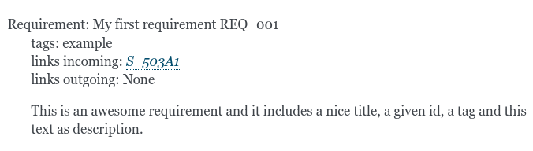
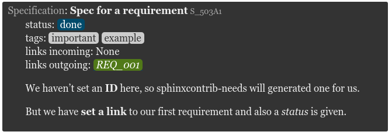

.. _styles:

Layouts & Styles
================

``Sphinx-Needs`` provides functions to manipulate the output structure (layout) and the style of a need.

Layouts are defined by a preconfigured table grid and the data, which shall be shown inside specific grid cells.
Styles define mostly the color of a need.

Both features can be set directly during need-configuration or inside the sphinx ``conf.py`` file.

For **html output** the used layout and style names are added as css-class to the need table object.
Beside this also the used grid system is added::

   <table class="need needs_grid_simple needs_layout_complex needes_style_blue docutils" id="SPEC_1">

The above line contains the following css classes:

* need: Each html table, which represents a ``need`` has the **need** class
* needs_grid_simple: Used grid system of the layout
* needs_layout_complex: Used layout
* needs_style_needs_blue: Used style

Please note, that the classes added by ``Sphinx-Needs`` always contain a prefix:
``needs_grid_``, ``needs_layout_``, ``needs_style_``.
So if a user defined layout has the name ``specification_layout``, the related css class is
``needs_layout_specification_layout``

Grids
-----

Layouts
-------
Layouts are using a predefined grid system and define which data shall be shown in which grid-cells.

The can be multiple layouts using the same grid-system, but maybe showing different data. E.g. a layout for
bugs and one for specifications.

``Sphinx-Needs`` comes with some predefined layouts.
But the can be extend or overwritten by user to create own, use case specific layouts.

Most useful layout are:

.. list-table::
   :header-rows: 1
   :stub-columns: 1
   :widths: 20 20 60

   - * Layout
     * Used grid
     * Comment
   - * clean
     * simple
     * The standard ``Sphinx-Needs`` layout
   - * complete
     * complex
     * Divided head, meta, footer rows. Showing really all user-added data.
   - * focus
     * content
     * Content focused layout. Showing content only. Nothing more.

There are also some *extensions* for the layouts above available:

.. list-table::
   :header-rows: 1
   :stub-columns: 1
   :widths: 20 20 60

   - * Layout
     * Used grid
     * Comment
   - * clean_l
     * simple_side_left
     * Like `clean` but with an extra side element on left side
   - * clean_r
     * simple_side_right
     * Like `clean` but with an extra side element on right side
   - * clean_lp
     * simple_side_left_partial
     * Like `clean` but with an extra, small side element on left side
   - * clean_rp
     * simple_side_right_partial
     * Like `clean` but with an extra, small side element on right side
   - * focus_f
     * content_footer
     * Adds a small footer below content with the need id.
   - * focus_l
     * content_side_left
     * Adds a small footer to the left side of content, showing the need id.

Special layouts:

.. list-table::
   :header-rows: 1
   :stub-columns: 1
   :widths: 20 20 60

   - * Layout
     * Used grid
     * Comment
   - * debug
     * content_footer
     * Shows **all** meta data (also internal ones) in the footer.
       Useful do see what data is available for a need and which can be used in :ref:`filter_string`.

Styles
------

Customisation
=============

The layout and structure of needs can be highly customized.

There are three ways to do this:

* Define own jinja template for a need
* Provide a css file by using :ref:`needs_css`
* Set own css on sphinx level

Need jinja template
-------------------

Please see :ref:`needs_template` on the configuration page.

.. _styles_css:

Sphinx-needs CSS option
-----------------------

A css file can be set in the **conf.py** file by setting **needs_css**.
See :ref:`needs_css` on the configuration page for more information.

Sphinx-needs provides the following css styles:

**blank.css**

**modern.css**

.. image:: _static/need_modern.png

**dark.css**

blank.css
~~~~~~~~~
.. literalinclude:: ../sphinxcontrib/needs/css/blank.css

modern.css
~~~~~~~~~~
.. literalinclude:: ../sphinxcontrib/needs/css/modern.css

dark.css
~~~~~~~~
.. literalinclude:: ../sphinxcontrib/needs/css/dark.css

Own CSS file on sphinx level
----------------------------

If you want to use most of the sphinx-needs internal styles but only need some specific changes for single elements, you
can provide your own CSS file by register it inside your conf.py::

    def setup(app):
        app.add_stylesheet('css/my_custom.css')  # may also be an URL

.. hint::

    Do not name it **custom.css** if you are using `Read the docs <http://readthedocs.org>`_ as
    this name is already taken.

