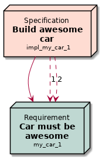

.. _roles:

Roles
=====

You can use Roles to get short information of needs inside single sentences.

|ex|

..  code-block:: rst

    My specification :need:`my_spec` is used to fulfill requirements :need_incoming:`my_spec`

.. _role_need:

need
----

The role ``:need:`` will add title, id and a link to the need.

We use it to reference an existing need, without the need to keep title and link location manually in sync.

Example
~~~~~~~

.. req:: Sliced Bread
   :id: roles_req_1

|ex|

.. code-block:: rst

   The requirement :need:`roles_req_1` is the most important one.

   But we can also set :need:`a custom link name <roles_req_1>`.

   And we can change the text even more :need:`our specific link text ({{id}}) ({{status}}) <roles_req_1>`

|out|

| The requirement :need:`roles_req_1` is the most important one.
| But we can also set :need:`a custom link name <roles_req_1>`.
| And we can change the text even more :need:`our more specific link name ({{id}}) ({{status}}) <roles_req_1>`.

.. note::

   You can customize the string representation by using the
   configuration parameters :ref:`needs_role_need_template` and
   :ref:`needs_role_need_max_title_length`.
   If we find a `{` in the custumized string, we handle it 
   according to Python's `.format() <https://docs.python.org/3.4/library/functions.html#format>`_ 
   function.
   Please see https://pyformat.info/ for more information.
   RST-attributes like ``**bold**`` are **not** supported.

.. _role_need_outgoing:

need_outgoing
-------------
.. versionadded:: 0.1.25

``:need_outgoing:`` adds a list of all outgoing links of the given need.
The list contains the need IDs only, no title or any other information is printed.

Example
~~~~~~~

.. req:: Butter on Bread
   :id: roles_req_2
   :links: roles_req_1

|ex|

.. code-block:: jinja

   To get butter on our bread, we need to fulfill :need_outgoing:`roles_req_2`

|out|

To get butter on our bread, we need to fulfill :need_outgoing:`roles_req_2`

.. _role_need_incoming:

need_incoming
-------------
.. versionadded:: 0.1.25

``:need_incoming:`` prints a list of IDs of needs which have set outgoing links to the given need.

Example
~~~~~~~

|ex|

.. code-block:: jinja

   The realisation of **Sliced Bread** is really important because the needs :need_incoming:`roles_req_1` are based on
   it.

|out|

The realisation of **Sliced Bread** is really important because the
needs :need_incoming:`roles_req_1` are based on it.

.. _need_part:

need_part / np
----------------
.. versionadded:: 0.3.0

You can use ``:need_part:`` or as shortcut ``:np:`` inside needs to set a sub-id for a specific sentence/part.
This sub-ids can be linked and referenced in other need functions like links and co.

The used need_part id can be freely chosen, but should not contain any whitespaces or dots.

Example
~~~~~~~

|ex|

.. code-block:: rst

   .. req:: Car must be awesome
      :id: my_car_1
      :tags: car
      :status: open

      My new car must be the fastest on the world. Therefor it shall have:

      * :need_part:`(1)A top speed of 300 km/h`
      * :np:`(2) An acceleration of 200 m/s² or much much more`

      And we also need --> :np:`(awesome_3) a turbo button`!

   .. spec:: Build awesome car
      :id: impl_my_car_1
      :links: my_car_1.1, my_car_1.2

      Requirements :need:`my_car_1.1` and :need:`my_car_1.2` are no problem and can
      be realised by doing rocket science.

      But no way to get :need:`my_car_1.awesome_3` realised.

   Reference to a part of a need from outside need scope: :need:`my_car_1.2`.

|out|

.. req:: Car must be awesome
   :id: my_car_1
   :tags: car
   :status: open

   My new car must be the fastest on the world. Therefor it shall have:

   * :need_part:`(1) A top speed of 300 km/h`
   * :np:`(2) An acceleration of 200 m/s² or much much more`

   And we also need --> :np:`(awesome_3) a turbo button`!

.. spec:: Build awesome car
   :id: impl_my_car_1
   :links: my_car_1, my_car_1.1, my_car_1.2
   :tags: car

   Requirements :need:`my_car_1.1` and :need:`my_car_1.2` are no problem and can
   be realised by doing rocket science.

   But no way to get :need:`my_car_1.awesome_3` realised.

Reference to a part of a need from outside need scope: :need:`my_car_1.2`.

**Presentation in needflow**

Links to need_parts are shown as dotted line to the upper need inside :ref:`needflow` diagrams.
They are also getting the part_id as link description.

|ex|

.. code-block:: rst

   .. needflow::
      :filter: id in ["my_car_1","impl_my_car_1"]

|out|


..



.. needflow::
   :filter: id in ["my_car_1","impl_my_car_1"]



**Presentation in needtable**

Please see :ref:`needtable_show_parts` of :ref:`needtable` configuration documentation.

|ex|

.. code-block:: rst

   .. needtable::
      :style: table
      :filter: 'car' in tags and is_need
      :show_parts:
      :columns: id, title, incoming, outgoing

|out|

.. needtable::
   :style: table
   :filter: 'car' in tags and is_need
   :show_parts:
   :columns: id, title, incoming, outgoing

.. _need_count:

need_count
----------
.. versionadded:: 0.3.1

Counts found needs for a given filter and shows the final amount.

The content of the role must be a valid filter-string as used e.g. by :ref:`needlist` in the ``:filter:`` option.
See :ref:`filter_string` for more information.

Example
~~~~~~~

|ex|

.. code-block:: rst

   All needs: :need_count:`True`
   Specification needs: :need_count:`type=='spec'`
   Open specification needs: :need_count:`type=='spec' and status=='open'`
   Needs with tag *test*: :need_count:`'test' in tags`
   Needs with title longer 10 chars: :need_count:`search("[\\w\\s]{10,}", title)`
   All need_parts: :need_count:`is_part`
   All needs containing need_parts: :need_count:`is_need and len(parts)>0`

|out|

| All needs: :need_count:`True`
| Specification needs: :need_count:`type=='spec'`
| Open specification needs: :need_count:`type=='spec' and status=='open'`
| Needs with tag *test*: :need_count:`'test' in tags`
| Needs with title longer 10 chars: :need_count:`search("[\\w\\s]{10,}", title)`
| All need_parts: :need_count:`is_part`
| All needs containing need_parts: :need_count:`is_need and len(parts)>0`

.. note::

   If backslashes ``\`` are used inside the regex function ``search``, please make sure to double them as in python
   one ``\`` needs to be represented by ``\\``.

.. note::

   ``need_count`` executes the given filter on needs and need_parts!
   So if you use :ref:`need_part` , the result may contain the amount of found needs *and* found need_parts.
   To avoid this, add ``is_need`` or ``is_part`` to your filter.

.. _need_count_ratio:

Ratio
~~~~~

.. versionadded:: 0.5.3

To calculate the ratio of one filter to another filter, you can define two filters separated by ``_?_``
(question mark surrounded by one space on each side).

|ex|

.. code-block:: rst

   :need_count:`status = open and type == "spec" ? type == "spec"`% of our specifications are open.

|out|

:need_count:`status == "open" and type == "spec" ? type == "spec"` % of our specifications are open.

.. _need_func:

need_func
---------
.. versionadded:: 0.6.3

Executes :ref:`dynamic_functions` and uses the return values as content.

|ex|

.. code-block:: rst

    A nice :need_func:`[[echo("first")]] test` for need_func.

|out|

A nice :need_func:`[[echo("first")]] test` for need_func.
