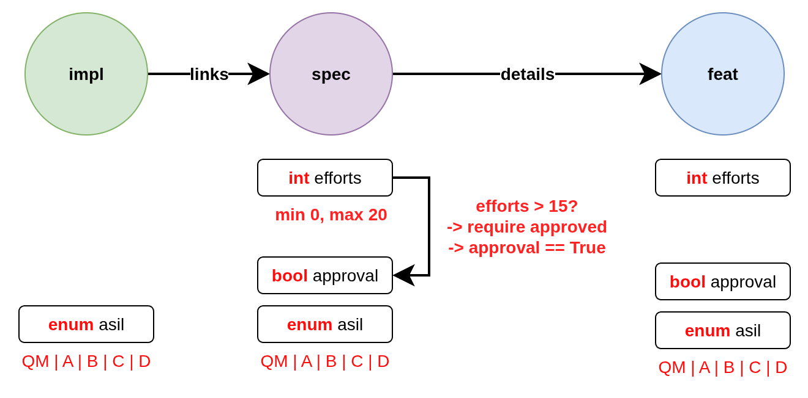

.. _ubcode: https://ubcode.useblocks.com/
.. _`schema_validation`:

Schema validation
=================

This is the documentation of the schema validation implementation as proposed in
the `Github discussion #1451 <https://github.com/useblocks/sphinx-needs/discussions/1451>`__.

The new schema validation is a versatile, fast, safe and declarative way to enforce constraints
on need items and their relations in Sphinx-Needs. It is supposed to replace the legacy
:ref:`needs_constraints` and :ref:`needs_warnings` configuration options.
See :ref:`migration_from_warnings_constraints` for details on how to migrate.

Imagine the following modeling of need items:

There are a few things to note about this setup:

- the extra options ``efforts``, ``approval`` and
  ``asil`` (for **A**\ utomotive **S**\ ecurity **I**\ ntegrity **L**\ evel) are typed
- the assigned extra options differ between need types
- the fields may be optional for a need type, required or even not allowed
- some validation rules are local to the need itself, while others
  require information from other needs (network validation)
- the needs link to each other in a specific way, so a
  safe ``impl`` can only link to a safe ``spec`` which can only
  link to a safe ``feat`` item

The schema validation in Sphinx-Needs allows you to define declarative rules for validating need
items based on their types, properties and relationships.

This includes both local checks (validating properties of a single need) and network checks
(validating relationships between multiple needs). The distinction is especially important in
an IDE context, where local checks can provide instant feedback while network requires building
the full network index first.

Schema Configuration
--------------------

Schemas can be configured in two ways: directly in the ``conf.py`` file or loaded from a separate
JSON file.

**JSON File Configuration (recommended)**

The preferred approach is to define schemas in a separate JSON file and load them using the
:ref:`needs_schemas_from_json` configuration option:

.. code-block:: python

   # conf.py
   needs_schemas_from_json = "schemas.json"

Then create a ``schemas.json`` file in your project root:

.. code-block:: json

   {
     "$defs": {
       "type-spec": {
         "properties": {
           "type": { "const": "spec" }
         }
       },
     },
     "schemas": [
       {
         "severity": "warning",
         "message": "id must be uppercase",
         "select": {
             "$ref": "#/$defs/type-spec"
         },
         "validate": {
           "local": {
             "properties": {
               "id": { "pattern": "^SPEC_[A-Z0-9_]+$" }
             }
           }
         }
       }
     ]
   }

**Benefits of JSON File Configuration:**

- **Declarative**: Schema definitions are separate from Python configuration
- **Version Control**: Easy to track changes to validation rules
- **IDE Support**: `ubCode`_ can read the JSON file

**Python Configuration (Alternative)**

Alternatively, schemas can be configured directly using the :ref:`needs_schemas`
configuration option in ``conf.py``:

.. code-block:: python

   needs_schemas = {
     "$defs": {
       # reusable schema components
       "type-spec": {
         "properties": {
           "type": { "const": "spec" }
         }
       },
     },
     "schemas": [
       {
         "severity": "warning",
         "message": "id must be uppercase",
         "select": {
             "$ref": "#/$defs/type-spec"
         },
         "validate": {
           "local": {
             "properties": {
               "id": { "pattern": "^SPEC_[A-Z0-9_]+$" }
             }
           }
         }
       }
     ]
   }

.. _`local_validation`:

Local Validation
----------------

Consider the following local checks:

Local validation checks individual need properties without requiring information from other needs:

- the ``efforts`` field

  - is of type integer
  - is optional for ``spec`` and ``feat`` and disallowed for ``impl``
  - has a minimum value of 0
  - has a maximum value of 20

- the ``approval`` field

  - is of type boolean
  - is optional for ``spec`` and ``feat`` and disallowed for ``impl``
  - is required in case the field ``efforts`` has a value greater than 15;
    if the condition is not satisfied, the violation should be returned as ``violation``
  - must be set to ``True`` in case the field ``efforts`` has a value greater than 15;
    if the condition is not satisfied, the violation should be returned as ``warning``

- the ``asil`` field

  - is of type string
  - has a string subtype of ``enum``
  - can only be set to one of the following values: ``QM | A | B | C | D``

Example local validation schema:

.. code-block:: json

   {
     "$defs": {
       "type-feat": {
         "properties": {
           "type": { "const": "feat" }
         }
       },
       "type-spec": {
         "properties": {
           "type": { "const": "spec" }
         }
       },
       "type-impl": {
         "properties": {
           "type": { "const": "impl" }
         }
       },
       "safe-feat": {
         "allOf": [
           { "$ref": "#/$defs/safe-need" },
           { "$ref": "#/$defs/type-feat" }
         ]
       },
       "safe-spec": {
         "allOf": [
           { "$ref": "#/$defs/safe-need" },
           { "$ref": "#/$defs/type-spec" }
         ]
       },
       "safe-impl": {
         "allOf": [
           { "$ref": "#/$defs/safe-need" },
           { "$ref": "#/$defs/type-impl" }
         ]
       },
       "safe-need": {
         "properties": {
           "asil": {
             "enum": ["A", "B", "C", "D"]
           }
         },
         "required": ["asil"]
       },
       "high-efforts": {
         "properties": {
           "efforts": { "minimum": 15 }
         },
         "required": ["efforts"]
       }
     },
     "schemas": [
       {
         "id": "spec",
         "select": { "$ref": "#/$defs/type-spec" },
         "validate": {
           "local": {
             "properties": {
               "id": { "pattern": "^SPEC_[a-zA-Z0-9_-]*$" },
               "efforts": { "minimum": 0 }
             },
             "unevaluatedProperties": false
           }
         }
       },
       {
         "id": "spec-approved-required",
         "severity": "violation",
         "message": "Approval required due to high efforts",
         "select": {
           "allOf": [
             { "$ref": "#/$defs/high-efforts" },
             { "$ref": "#/$defs/type-spec" }
           ]
         },
         "validate": {
           "local": {
             "required": ["approved"]
           }
         }
       },
       {
         "id": "spec-approved-not-given",
         "severity": "info",
         "message": "Approval not given",
         "select": {
           "allOf": [
             { "$ref": "#/$defs/type-spec" },
             { "$ref": "#/$defs/high-efforts" }
           ]
         },
         "validate": {
           "local": {
             "properties": {
               "approved": { "const": true }
             },
             "required": ["approved"]
           }
         }
       }
     ]
   }

Above conditions can all be checked locally on need level which allows instant user feedback
in IDE extensions such as `ubCode`_.

Network Validation
------------------

On the other hand, network checks require information from other needs:

After network resolution, the following checks can be performed:

- a 'safe' ``impl`` that has an ``asil`` of ``A | B | C | D`` cannot ``link`` to ``spec`` items
  that have an ``asil`` of ``QM``
- a safe ``impl`` can only link to 'approved' ``spec`` items with link type ``details``
- likewise, a safe ``spec`` can only link to safe and approved ``feat`` items
- the safe ``impl`` can link to *one or more* safe ``spec`` items
- a spec can only link to *exactly one* ``feat``
- additional links to non-validating items are not allowed (that is the min/max constraints are
  met but there are failing additional link targets)

Example network validation schema:

.. code-block:: json

   {
     "$defs": {
       "type-feat": {
         "properties": {
           "type": { "const": "feat" }
         }
       },
       "type-spec": {
         "properties": {
           "type": { "const": "spec" }
         }
       },
       "type-impl": {
         "properties": {
           "type": { "const": "impl" }
         }
       },
       "safe-feat": {
         "allOf": [
           { "$ref": "#/$defs/safe-need" },
           { "$ref": "#/$defs/type-feat" }
         ]
       },
       "safe-spec": {
         "allOf": [
           { "$ref": "#/$defs/safe-need" },
           { "$ref": "#/$defs/type-spec" }
         ]
       },
       "safe-impl": {
         "allOf": [
           { "$ref": "#/$defs/safe-need" },
           { "$ref": "#/$defs/type-impl" }
         ]
       },
       "safe-need": {
         "properties": {
           "asil": {
             "enum": ["A", "B", "C", "D"]
           }
         },
         "required": ["asil"]
       },
       "high-efforts": {
         "properties": {
           "efforts": { "minimum": 15 }
         },
         "required": ["efforts"]
       }
     },
     "schemas": [
       {
         "id": "safe-spec-[details]->safe-feat",
         "message": "Safe spec details safe and approved feat",
         "select": { "$ref": "#/$defs/safe-spec" },
         "validate": {
           "network": {
             "details": {
               "contains": {
                 "local": {
                   "properties": {
                     "approved": { "const": true }
                   },
                   "required": ["approved"],
                   "allOf": [{ "$ref": "#/$defs/safe-feat" }]
                 }
               },
               "minContains": 1,
               "maxContains": 1,
               "unevaluatedItems": false
             }
           }
         }
       },
       {
         "id": "safe-impl-[links]->safe-spec",
         "message": "Safe impl links to safe spec",
         "select": { "$ref": "#/$defs/safe-impl" },
         "validate": {
           "network": {
             "links": {
               "contains": {
                 "local": { "$ref": "#/$defs/safe-spec" }
               },
               "minContains": 1,
               "unevaluatedItems": false
             }
           }
         }
       }
     ]
   }

Network Link Validation
~~~~~~~~~~~~~~~~~~~~~~~

Network validation supports various constraints on linked needs:

**Link Count Constraints**

- ``minContains``: Minimum number of valid links required
- ``maxContains``: Maximum number of valid links allowed

.. code-block:: json

   {
     "validate": {
       "network": {
         "links": {
           "minContains": 1, // At least one link required
           "maxContains": 3 // Maximum three links allowed
         }
       }
     }
   }

**Link Target Validation**

The ``items`` property defines validation rules for each linked need:

.. code-block:: json

   {
     "validate": {
       "network": {
         "links": {
           "contains": {
             "local": {
               "properties": {
                 "status": { "const": "approved" }
               }
             }
           }
         }
       }
     }
   }

**Nested Network Validation**

Network validation can be nested to validate multi-hop link chains:

.. code-block:: json

   {
       "id": "safe-impl-chain",
       "select": {"$ref": "#/$defs/safe-impl"},
       "validate": {
           "network": {
               "links": {
                   "contains": {
                       "local": {"$ref": "#/$defs/safe-spec"},
                       "network": {
                           "links": {
                               "contains": {
                                   "local": {"$ref": "#/$defs/safe-feat"}
                               },
                               "minContains": 1
                           }
                       }
                   },
                   "minContains": 1
               }
           }
       }
   }

This validates that:

1. A safe implementation links to safe specifications
#. Those specifications in turn link to safe features
#. Both link levels have minimum/maximum count requirements

**Unevaluated Items Control**

The ``unevaluatedItems`` property controls whether links that don't match the ``items`` schema are
allowed:

- ``unevaluatedItems: false`` - Only links matching the ``items`` schema are allowed
- ``unevaluatedItems: true`` (default) - Additional links not matching ``items`` are permitted

.. code-block:: json

   {
       "validate": {
           "network": {
               "links": {
                   "contains": {
                       "local": {"$ref": "#/$defs/approved-spec"}
                   },
                   "unevaluatedItems": false  // Reject any non-approved specs
               }
           }
       }
   }

When ``unevaluatedItems: false`` is set and a need links to items that don't match the
``items`` schema, the validation will report an error like:

.. code-block:: text

   Schema message: 1 unevaluated links of type 'links' found / ok: SPEC_APPROVED / nok: SPEC_UNAPPROVED

Schema Components
-----------------

Select Criteria
~~~~~~~~~~~~~~~

The ``select`` section defines which needs the schema applies to:

.. code-block:: json

   {
     "select": {
       "allOf": [
         { "$ref": "#/$defs/type-spec" },
         { "$ref": "#/$defs/high-efforts" }
       ]
     }
   }

If no ``select`` is provided, the schema applies to all needs.
``select`` is always a local validation, meaning it only checks properties of the need itself.
``select`` validation also means all link fields are list of need ID strings, not need objects.

Validation Rules
~~~~~~~~~~~~~~~~

The ``validate`` section contains the actual validation rules:

**Local validation** checks individual need properties:

.. code-block:: json

   {
     "validate": {
       "local": {
         "properties": {
           "status": { "enum": ["open", "closed", "in_progress"] }
         },
         "required": ["status"]
       }
     }
   }

``local`` validation also means all link fields are list of need ID strings, not need objects.

**Unevaluated Properties Control**

The ``unevaluatedProperties`` property controls whether properties not explicitly defined in the
schema are allowed:

.. code-block:: json

   {
     "validate": {
       "local": {
         "properties": {
           "status": { "enum": ["open", "closed"] }
         },
         "unevaluatedProperties": false // Only 'status' property allowed
       }
     }
   }

When ``unevaluatedProperties: false`` is set and a need has additional properties,
validation will report:

.. code-block:: text

   Schema message: Unevaluated properties are not allowed ('comment', 'priority' were unexpected)

This is useful for enforcing strict property schemas and catching typos in property names.
To find out which properties are actually set, the validated needs are reduced to field values
that are not on their default value.

**unevaluatedProperties with allOf**

The ``unevaluatedProperties`` validation also works with properties defined in ``allOf`` constructs.
Properties from all schemas in the ``allOf`` array are considered as evaluated:

.. code-block:: json

   {
     "validate": {
       "local": {
         "properties": { "asil": {} },
         "unevaluatedProperties": false,
         "allOf": [
            { "properties": { "comment": {} } }
         ]
       }
     }
   }

In this example, both ``asil`` and ``comment`` properties are considered evaluated, so only these
two properties would be allowed on the need. Empty schemas for a field are allowed to mark
them as evaluated. The behavior is aligned with the JSON Schema specification.

**required vs unevaluatedProperties**

The ``required`` list has no impact on ``unevaluatedProperties`` validation.
Properties listed in ``required`` must still be explicitly defined in ``properties`` or pulled
in via ``allOf`` to be considered evaluated:

.. code-block:: json

   {
     "validate": {
       "local": {
         "properties": { "status": {} },
         "required": ["status", "priority"], // priority not in properties
         "unevaluatedProperties": false
       }
     }
   }

In this case, a need with a ``priority`` property would still trigger an unevaluated properties
error, even though ``priority`` is in the ``required`` list.

Severity Levels
~~~~~~~~~~~~~~~

Each schema can specify a severity level:

- ``violation`` (default): Violation message
- ``warning``: Warning message
- ``info``: Informational message

.. code-block:: json

   {
     "severity": "warning",
     "message": "Approval required due to high efforts"
   }

The config :ref:`needs_schemas_severity` can be used to define a minimum severity level for a
warning to be reported.

Schema Definitions ($defs)
~~~~~~~~~~~~~~~~~~~~~~~~~~

Reusable schema components can be defined in the ``$defs`` section:

.. code-block:: json

   {
     "$defs": {
       "type-feat": {
         "properties": {
           "type": { "const": "feat" }
         }
       },
       "safe-need": {
         "properties": {
           "asil": { "enum": ["A", "B", "C", "D"] }
         },
         "required": ["asil"]
       },
       "safe-feat": {
         "allOf": [
           { "$ref": "#/$defs/safe-need" },
           { "$ref": "#/$defs/type-feat" }
         ]
       }
     }
   }

A full example is outlined in the :ref:`local_validation` section.

Error Messages
--------------

Validation errors include detailed information:

- **Severity**: The severity level of the violation
- **Field**: The specific field that failed validation
- **Need path**: The ID of the need that failed or the link chain for network validation
- **Schema path**: The JSON path within the schema that was violated
- **User message**: Custom message from the needs_schema.schemas list
- **Schema message**: Detailed technical validation message from the validator

Example error output::

  Need 'SPEC_P01' has validation errors:
    Severity:       violation
    Field:          id
    Need path:      SPEC_P01
    Schema path:    spec[1] > local > properties > id > pattern
    Schema message: 'SPEC_P01' does not match '^REQ[a-zA-Z0-9_-]*$'

For nested network validation, it can be difficult to determine which constraint and need
caused the error in the chain. In such cases, the error will emit details about the failed
need and the specific link that caused the issue::

  WARNING: Need 'IMPL_SAFE' has validation errors:
    Severity:       violation
    Need path:      IMPL_SAFE > links
    Schema path:    safe-impl-[links]->safe-spec-[links]->safe-req[0] > validate > network > links
    User message:   Safe impl links to safe spec links to safe req
    Schema message: Too few valid links of type 'links' (0 < 1) / nok: SPEC_SAFE

      Details for SPEC_SAFE
      Need path:      IMPL_SAFE > links > SPEC_SAFE > links
      Schema path:    safe-impl-[links]->safe-spec-[links]->safe-req[0] > links > validate > network > links
      Schema message: Too few valid links of type 'links' (0 < 1) / nok: REQ_UNSAFE

        Details for REQ_UNSAFE
        Field:          asil
        Need path:      IMPL_SAFE > links > SPEC_SAFE > links > REQ_UNSAFE
        Schema path:    safe-impl-[links]->safe-spec-[links]->safe-req[0] > links > links > local > allOf > 0 > properties > asil > enum
        Schema message: 'QM' is not one of ['A', 'B', 'C', 'D'] [sn_schema.network_contains_too_few]

Supported Data Types
--------------------

Sphinx-Needs supports comprehensive data type validation for need options through JSON Schema.
The following data types are available for need options:

String Type
~~~~~~~~~~~

The default data type for need options. Supports various format validations:

.. code-block:: json

   {
     "properties": {
       "description": {
         "type": "string",
         "minLength": 10,
         "maxLength": 500
       }
     }
   }

**String Formats**

String fields can be validated against specific formats using the ``format`` property:

**Date and Time Formats (ISO 8601)**

.. code-block:: json

   {
     "properties": {
       "start_date": {"type": "string", "format": "date"},          // 2023-12-25
       "created_at": {"type": "string", "format": "date-time"},     // 2023-12-25T14:30:00Z
       "meeting_time": {"type": "string", "format": "time"},        // 14:30:00
       "project_duration": {"type": "string", "format": "duration"} // P1Y2M10DT2H30M
     }
   }

**Communication Formats**

.. code-block:: json

   {
     "properties": {
       "contact_email": {"type": "string", "format": "email"}, // user@example.com (RFC 5322)
       "project_url": {"type": "string", "format": "uri"},     // https://example.com (RFC 3986)
       "tracking_id": {"type": "string", "format": "uuid"}     // 123e4567-e89b-12d3-a456-426614174000 (RFC 4122)
     }
   }

**Enumerated Values**

.. code-block:: json

   {
     "properties": {
       "priority": {
         "type": "string",
         "enum": ["low", "medium", "high", "critical"]
       }
     }
   }

Integer Type
~~~~~~~~~~~~

Whole number validation with range constraints:

.. code-block:: json

   {
     "properties": {
       "efforts": {
         "type": "integer",
         "minimum": 0,
         "maximum": 100,
         "multipleOf": 5
       }
     }
   }

**Note**: Values are stored as strings in Sphinx-Needs but validated as integers during
schema validation.

Number Type
~~~~~~~~~~~

Floating-point number validation:

.. code-block:: json

   {
     "properties": {
       "cost_estimate": {
         "type": "number",
         "minimum": 0.0,
         "exclusiveMaximum": 1000000.0
       }
     }
   }

**Note**: Values are stored as strings in Sphinx-Needs but validated as numbers during
schema validation.

Boolean Type
~~~~~~~~~~~~

Boolean validation with flexible input handling:

.. code-block:: json

   {
     "properties": {
       "approved": {"type": "boolean"},
       "is_critical": {"type": "boolean", "const": true}
     }
   }

**Accepted Boolean Values**:

- **Truthy**: ``true``, ``yes``, ``y``, ``on``, ``1``, ``True``, ``Yes``, ``On``
- **Falsy**: ``false``, ``no``, ``n``, ``off``, ``0``, ``False``, ``No``, ``Off``

The ``enum`` keyword cannot be used for booleans as ``const`` is functionally equivalent and
more expressive.

Array Type
~~~~~~~~~~

Multi-value options supporting arrays of the above basic types:

.. code-block:: json

   {
     "properties": {
       "tags": {
         "type": "array",
         "contains": {"type": "string"},
         "minContains": 1,
         "maxContains": 10,
         "splitChar": ","
       }
     }
   }

**Array Properties**:

- ``items``: Schema for individual array elements
- ``minContains`` / ``maxContains``: Array size constraints
- ``splitChar``: Character used to split string input (default: ``,``)
- ``unevaluatedItems``: Control whether non-matching items are allowed

.. note::

   This ``array`` type with ``splitChar`` does not yet work for extra options. This is
   planned for a future release.

Regex Pattern Restrictions
--------------------------

When using ``pattern`` for string types in schemas, the regex patterns must be compatible
across multiple language engines such as Python, Rust, and SQLite to consume the patterns
also in the bigger Sphinx-Needs ecosystem.
The following constructs are **not allowed**:

**Prohibited Constructs:**

- **Lookaheads/Lookbehinds**: ``(?=pattern)``, ``(?!pattern)``, ``(?<=pattern)``, ``(?<!pattern)``
- **Backreferences**: ``\1``, ``\2``, etc.
- **Nested Quantifiers**: ``(a+)+``, ``(a*)*`` (can cause catastrophic backtracking)
- **Possessive Quantifiers**: ``a++``, ``a*+`` (not supported in all engines)
- **Atomic Groups**: ``(?>pattern)`` (not supported in all engines)
- **Recursive Patterns**: ``(?R)`` (not supported in all engines)

**Safe Patterns:**

.. code-block:: json

   {
     "properties": {
       "id": { "pattern": "^[A-Z0-9_]+$" },           // ✓ Safe
       "version": { "pattern": "^v[0-9]+\\.[0-9]+$" }, // ✓ Safe
       "status": { "pattern": "^(open|closed)$" }      // ✓ Safe
     }
   }

**Unsafe Patterns:**

.. code-block:: json

   {
     "properties": {
       "id": { "pattern": "^(?=.*[A-Z]).*$" },      // ✗ Lookahead
       "ref": { "pattern": "^(\\w+)_\\1$" },        // ✗ Backreference
       "complex": { "pattern": "^(a+)+$" }          // ✗ Nested quantifiers
     }
   }

The validation will reject schemas containing unsafe patterns and provide
clear error messages indicating the specific issue. Some constructs might be
restricted in future versions of Sphinx-Needs if they cannot be safely evaluated
in all relevant engines.

Best Practices
--------------

1. **Use descriptive IDs**: Give your schemas meaningful IDs for easier debugging
#. **Leverage $defs**: Define reusable schema components to avoid duplication
#. **Start with warnings**: Use ``warning`` severity during development, then upgrade to ``violation``
#. **Provide clear messages**: Include helpful ``message`` fields to guide users
#. **Test incrementally**: Add schemas gradually to avoid overwhelming validation errors
#. **Use select wisely**: Only apply schemas to relevant need types using ``select``

.. _`migration_from_warnings_constraints`:

Migration from Legacy Validation
--------------------------------

The schema validation system is designed to replace the older :ref:`needs_constraints` and
:ref:`needs_warnings` configuration options, offering significant advantages:

**Advantages over needs_constraints and needs_warnings:**

- **Declarative**: JSON-based configuration instead of Python code
- **Performance**: Pre-compiled schemas with optimized validation
- **IDE Support**: Full IntelliSense and validation in supported editors like `ubCode`_
- **Type Safety**: Strong typing with comprehensive data type support
- **Network Validation**: Multi-hop link validation capabilities
- **Maintainability**: Easier to read, write, and version control

**Migration Examples**

**From needs_constraints:**

.. code-block:: python

   # Old approach - needs_constraints
   needs_constraints = {
       "security": {
           "check_0": "'security' in tags",
           "severity": "CRITICAL"
       },
       "critical": {
           "check_0": "'critical' in tags",
           "severity": "CRITICAL",
           "error_message": "need {{id}} does not fulfill CRITICAL constraint"
       }
   }

.. code-block:: json

   {
     "schemas": [
       {
         "id": "security-constraint",
         "severity": "violation",
         "message": "Security needs must have security tag",
         "select": {
           "properties": {
             "tags": {
               "type": "array",
               "contains": {"const": "security"}
             }
           }
         },
         "validate": {
           "local": {
             "properties": {
               "tags": {
                 "type": "array",
                 "contains": {"const": "security"}
               }
             }
           }
         }
       }
     ]
   }

**From needs_warnings:**

.. code-block:: python

   # Old approach - needs_warnings
   def my_custom_warning_check(need, log):
       if need["status"] not in ["open", "closed", "done"]:
           return True
       return False

   needs_warnings = {
       "invalid_status": "status not in ['open', 'closed', 'done']",
       "type_match": my_custom_warning_check
   }

.. code-block:: json

   {
     "schemas": [
       {
         "id": "valid-status",
         "severity": "warning",
         "message": "Status must be one of the allowed values",
         "validate": {
           "local": {
             "properties": {
               "status": {
                 "enum": ["open", "closed", "done"]
               }
             },
             "required": ["status"]
           }
         }
       }
     ]
   }

**Network Validation Benefits**

The schema system provides capabilities not available in the legacy systems:

.. code-block:: json

   {
     "schemas": [
       {
         "id": "safe-implementation-links",
         "message": "Safe implementations must link to approved specifications",
         "select": {
           "allOf": [
             {"$ref": "#/$defs/type-impl"},
             {"$ref": "#/$defs/safety-critical"}
           ]
         },
         "validate": {
           "network": {
             "links": {
               "contains": {
                 "local": {
                   "allOf": [
                     {"$ref": "#/$defs/type-spec"},
                     {"properties": {"approved": {"const": true}}}
                   ]
                 }
               },
               "minContains": 1
             }
           }
         }
       }
     ]
   }

This type of multi-need relationship validation was not possible with the legacy constraint
and warning systems.

**Recommended Migration Path**

1. **Audit existing constraints and warnings**: Review your current validation rules
2. **Start with local validations**: Convert simple property checks first
3. **Leverage network validation**: Replace complex Python logic with declarative schemas
4. **Test incrementally**: Validate schemas work as expected before removing legacy rules
5. **Update documentation**: Ensure team members understand the new validation approach
