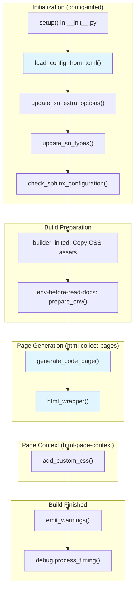

# AGENTS.md — packages/sphinx-codelinks

The delta for this package. Everything repository-level — the workspace layout, the
commands, the lock, lint/format/type-check configuration, the release recipe, the pull
request requirements and the commit-message convention — is in the ROOT
[`AGENTS.md`](../../AGENTS.md), and this file does not repeat it. What is here is what an
agent has to know that is true of sphinx-codelinks and not of the workspace.

## Project Overview

sphinx-codelinks is a Sphinx extension that provides fast source code traceability for
sphinx-needs. It:

- **analyses source code** — scans C, C++, C#, Python, Rust, Go, YAML, JSON and Bash files
  for special comment markers, with tree-sitter;
- **creates needs from them** — turns discovered markers into sphinx-needs items;
- **traces sources** — links documentation to exact source lines, and generates a
  syntax-highlighted HTML page per traced file with line anchors;
- **has a CLI** — `codelinks analyse`, `codelinks discover` and `codelinks write rst`,
  for use outside a Sphinx build.

It is the only member of this workspace whose `src/` imports `sphinx_needs`, and it
declares it as a **runtime** dependency with a tight floor (`sphinx-needs>=8.5.0,<9`,
which `check_workspace.py` check (4) enforces against the sibling's current version, and
`propagate_floors.py` moves at each sphinx-needs release).

## Package structure

```text
pyproject.toml          # `[project]`, `[project.urls]`, `[build-system]` and nothing else:
                        #   ruff, ty, pytest and the dependency groups are the ROOT's
.readthedocs.yaml       # this package's RTD project; every path in it is relative to the
                        #   REPOSITORY root, not to the file
README.md · LICENSE
design/                 # import-commit-map.txt: old hash -> new hash for the 2026-09 import

src/sphinx_codelinks/   # Main source code
├── __init__.py         # `__version__` (public, in `__all__`) and the Sphinx `setup()`
├── cmd.py              # CLI commands using Typer
├── config.py           # Configuration dataclasses + TypedDicts, and the TOML loader
├── logger.py           # Logging utilities
├── needextend_write.py # Write RST files with Sphinx-Needs directives
├── analyse/            # Code analysis module
│   ├── analyse.py      # Main analysis orchestration
│   ├── models.py       # dataclasses/TypedDicts/Enums for analysis results
│   ├── oneline_parser.py # One-line comment parser
│   ├── projects.py     # Project-specific analyzers (C++, Python, etc.)
│   ├── utils.py        # Analysis utilities, including the git-root helpers
│   └── preproc/        # the OPTIONAL libclang engine -- see below
├── source_discover/    # Source file discovery
│   ├── config.py       # Discovery configuration
│   └── source_discover.py # File discovery logic
└── sphinx_extension/   # Sphinx extension components
    ├── source_tracing.py # Main Sphinx extension setup
    ├── html_wrapper.py  # HTML output wrapper for traced source
    ├── debug.py         # Debug utilities
    ├── ub_sct.css       # CSS for source tracing UI
    └── directives/      # Custom Sphinx directives

tests/                  # Test suite -- `tests/__init__.py` is why this path is NOT in the
├── __init__.py         #   root `testpaths` (see the root AGENTS.md)
├── conftest.py         # Pytest fixtures and configuration
├── test_*.py           # 16 test modules
├── __snapshots__/      # Syrupy snapshot test fixtures
├── data/               # Test data and fixtures
└── doc_test/           # minimal Sphinx projects for the integration tests

docs/                   # Documentation source (RST) -- conf.py sits IN the source dir,
├── conf.py             #   so `sphinx-build docs docs/_build/html` needs no `-c`
├── ubproject.toml      # this docs project's own needs + codelinks configuration
├── changelog.rst       # `bump.py` stamps this path; do not move it
├── index.rst · basics/ · components/ · development/ · _static/
```

## The two facts that are workspace-specific

### libclang is optional, and 56 tests depend on it

The preprocessor-aware C/C++ engine (`analyse/preproc/`) needs `clang.cindex`, which comes
from the `libclang` wheel. It is optional at runtime — the member's `libclang` extra — and
`analyse/preproc/__init__.py` imports the loader **eagerly**, so importing anything under
that package without the wheel raises.

In this workspace the wheel is the root dependency group **`codelinks-libclang`**, not part
of `test`: it is 23 MiB and 81 MB on disk, and every cell of every package would otherwise
pay for it. Every `test-codelinks*` poe task adds the group, and so does CI's Extensions
cell.

**`test-codelinks` syncs the group into the DEFAULT `.venv`.** It has no
`UV_PROJECT_ENVIRONMENT` of its own, unlike its three `-sphinx7/8/9` siblings, so the wheel
lands in the environment every other command uses — and the next plain `uv sync --frozen`
prunes it out again (`Uninstalled 1 package: - libclang==18.1.1`). So the two numbers only
appear either side of that sync, and this is the sequence that shows both:

```bash
uv run poe test-codelinks                                            # 359 passed
uv sync --frozen                                                     # removes libclang again
uv run --frozen --no-sync pytest packages/sphinx-codelinks/tests     # 303 passed, 26 skipped
```

**Both runs are green, and only the first tested the engine.** The four modules that need
it carry `pytest.importorskip("clang.cindex")`, so a run without the group skips politely
rather than failing — which means a task or a CI line that quietly lost the group would
look like a pass. (CI is fenced: the Extensions cell asserts `import clang.cindex` right
after its sync.) If you are changing anything under `analyse/preproc/`, check the number.

The summary prints **26 skipped**, not 56: three of the four guards are module-level
`pytest.importorskip`, which pytest reports as one skip per module and never collects the
tests inside. 56 is how many test cases stop running.

### This package caps `click` and `typer`, and nothing else in the lock does

`click < 8.2` (8.2 produces empty errors when the CLI is given no arguments) and
`typer >=0.16.0,<0.26.8` (0.26.8 removed `rich_utils.STYLE_METAVAR`, which
`sphinxcontrib-typer` still imports for the docs build). Measured across every
`requires-dist` in `uv.lock`: **no other workspace MEMBER names either**, and for `click`
no package in the lock does at all. `typer`, `rich` and `shellingham` are named by third
parties there — `sphinxcontrib-typer` (which is exactly what the `typer` cap exists for),
`typer` itself, `memray` and `textual` — so the `typer` cap is the one that could bind on
someone else. The direction to watch is the reverse one: the day a root, `test` or `dev`
dependency wants `click>=8.2`, `uv lock` will fail and the reason will be here.

## Documentation

`uv run poe docs-codelinks` (and `docs-codelinks-clean`). `-nW --keep-going`, no renderer:
these docs draw no diagrams, so unlike `docs-needs` there is no `dot`, `java` or plantuml
to install. They DO need two things a normal checkout has and a stripped one may not:

- **a git remote and a readable git directory.** `src-trace` turns every traced source line
  into a blob link at the current rev, read out of the git directory's `config` and `HEAD`.
  Worktrees are handled (`_git_dir` / `_git_common_dir` in `analyse/utils.py`); a checkout
  with no `origin` is not, and the build fails under `-nW` with five
  `[codelinks.git_remote]` warnings.
- **network for intersphinx** to `sphinx-needs.readthedocs.io` and `www.sphinx-doc.org`.

These docs are the one end-to-end exercise of the extension — `src-trace` runs over four
projects of this package's own source — which is why CI builds them on every pull request
(`Docs codelinks` in `ci.yaml`).

## Code Style Guidelines

Formatting, linting and type checking are the ROOT's — one ruff configuration, one ty
configuration, one prek config (`uv run poe lint`, `uv run poe typecheck`). The root's
`[tool.ruff.lint.per-file-ignores]` carries this package's one entry
(`packages/sphinx-codelinks/tests/*`: `E402` for the `importorskip` guard pattern, `SIM300`
for a deliberate assert order). What is specific to this package:

- **Type annotations**: complete annotations on every function signature. Configuration
  and data structures are stdlib `@dataclass`, `TypedDict` and `Enum` — **there is no
  pydantic in this package** (`grep -rn pydantic src/` is empty, and it is not a
  dependency); a `TypedDict` describes the TOML shape and a `@dataclass` the loaded object.
- **Docstrings**: Sphinx-style (`:param:`, `:return:`, `:raises:`). No types in the
  docstring — they belong in the annotations.
- **Immutability**: prefer immutable structures; `@dataclass(frozen=True)` where it fits.
- **Pure functions** where possible.
- **Error handling**: descriptive exceptions, custom types where they help.

### Docstring Example

```python
def form_https_url(
    git_url: str, rev: str, project_path: Path, filepath: Path, lineno: int
) -> str | None:
    """Build the blob URL for one traced source line.

    :param git_url: The remote URL, in any form giturlparse accepts.
    :param rev: The commit the link should point at.
    :param project_path: The root `filepath` is made relative to.
    :param filepath: The traced file, ABSOLUTE and under `project_path`.
    :param lineno: The line to anchor on.
    :return: The URL, or the unchanged `git_url` if the host is unsupported.
    """
    ...
```

## Testing Guidelines

`uv run poe test-codelinks` (trailing arguments go to pytest), and
`test-codelinks-sphinx7/8/9` for one matrix cell each. Snapshots:
`uv run poe test-codelinks --snapshot-update`.

**No `--` before the pytest arguments.** poe appends trailing words to the task's command
verbatim and forwards a `--` along with them, and pytest then reads `--snapshot-update` as
a file path: `poe test-codelinks -- --collect-only -q` collects **0 items**, where
`poe test-codelinks --collect-only -q` collects 359.

### Test Structure

- Tests use `pytest` with fixtures from `conftest.py`, which also loads the workspace's
  shared test layer, `packages/sphinx-needs-testkit` — the doctree snapshot extension and
  the warning normalisation a build assertion goes through both come from there rather than
  from a copy here, so a warning means the same thing in this suite as in the other two
- Snapshot testing uses `syrupy` for complex output comparisons
- Test data is in `tests/data/`
- Sphinx integration tests use real Sphinx projects in `tests/doc_test/`
- `tests/test_analyse_utils.py` builds real `git init` repositories and a real
  `git worktree`, so `git` must be on PATH

### Writing Tests

1. For code analysis tests, create test data in `tests/data/` with source files
2. Use `syrupy` for comparing complex analysis outputs (JSON, doctrees, etc.)
3. For Sphinx integration, create minimal projects in `tests/doc_test/`
4. Use parametrized tests for testing multiple language parsers

### Test Best Practices

- **Test coverage**: write tests for all new functionality and bug fixes
- **Isolation**: each test independent of every other's state
- **Descriptive names**: the function name says what is tested
- **Snapshot testing**: `assert snapshot == result` for complex outputs
- **Parametrization**: `@pytest.mark.parametrize` for multiple scenarios
- **Fixtures**: reusable ones in `conftest.py`
- **No CWD assumptions.** The suite must pass both from `packages/sphinx-codelinks` and
  from the repository root, because CI runs it from the root. A test that resolves a
  relative path against the CWD passes in one and fails in the other — that was
  `test_form_https_url` until the import fixed it.

### Example Test Pattern

```python
from pathlib import Path

from sphinx_codelinks.analyse.analyse import SourceAnalyse
from sphinx_codelinks.config import SourceAnalyseConfig


def test_analyse_cpp_file(tmp_path: Path, snapshot) -> None:
    """One C++ file with one one-line marker produces one need."""
    # Arrange. The DEFAULT one-line style is `@` to end-of-line with comma-separated
    # fields in the order title, id, type, links -- `[[...]]` in tests/data/dcdc is a
    # configured `OneLineCommentStyle`, not the default. Each extractor is opt-in:
    # `get_oneline_needs` is False unless asked for. And `SourceAnalyse` does NOT discover
    # files -- `src_files` is what it reads, and `SourceDiscover` is what fills that list
    # in the CLI and in the extension
    source = tmp_path / "demo.cpp"
    source.write_text("// @the demo function, IMPL_demo, impl\nvoid demo() {}\n")
    config = SourceAnalyseConfig(
        src_files=[source], src_dir=tmp_path, get_oneline_needs=True
    )

    # Act
    analyse = SourceAnalyse(config)
    analyse.git_remote_url = None   # a tmp_path is not a repository
    analyse.git_commit_rev = None
    analyse.run()

    # Assert
    assert analyse.all_marked_content == snapshot
```

## Architecture Overview

### Analysis Pipeline

The code analysis follows a multi-stage pipeline:

```text
Source Files → Discovery → Parsing → Analysis → Results (JSON) → RST Generation
```

1. **Discovery** (`source_discover/`): Scan directories for source files matching patterns
2. **Parsing** (`analyse/oneline_parser.py`): Use tree-sitter to parse source code AST
3. **Analysis** (`analyse/analyse.py`, `analyse/projects.py`): Extract markers and metadata
4. **Output** (`needextend_write.py`): Generate RST with Sphinx-Needs directives

### Sphinx Integration Flow

The Sphinx extension hooks into multiple build events to provide source tracing:



#### Event Handlers

The extension connects to these Sphinx events (in execution order):

| Event                  | Handler                        | Purpose                                                              |
| ---------------------- | ------------------------------ | -------------------------------------------------------------------- |
| `config-inited`        | `load_config_from_toml()`      | Load configuration from TOML file if specified                       |
| `config-inited`        | `update_sn_extra_options()`    | Register sphinx-needs extra options (project, file, directory, URLs) |
| `config-inited`        | `update_sn_types()`            | Add `srctrace` need type to sphinx-needs                             |
| `config-inited`        | `check_sphinx_configuration()` | Validate configuration and raise errors                              |
| `builder-inited`       | `builder_inited()`             | Copy CSS assets to output directory                                  |
| `env-before-read-docs` | `prepare_env()`                | Initialize timing measurements and debug filters                     |
| `html-collect-pages`   | `generate_code_page()`         | Generate HTML pages for traced source files                          |
| `html-page-context`    | `add_custom_css()`             | Inject custom CSS for source tracing UI                              |
| `build-finished`       | `emit_warnings()`              | Emit collected warnings from analysis                                |
| `build-finished`       | `debug.process_timing()`       | Output timing measurements if enabled                                |

#### Key Integration Points

1. **sphinx-needs Dependency**: The extension requires sphinx-needs and checks for its presence in `setup()`. It adds extra options (`project`, `file`, `directory`, URL fields) and a custom need type (`srctrace`).

2. **TOML Configuration**: Configuration can be loaded from a TOML file specified in `conf.py` via `src_trace_config_from_toml`. The TOML is parsed and values are set on the Sphinx config object.

3. **Source Page Generation**: The `generate_code_page()` function yields tuples of `(pagename, context, template)` for each traced source file, allowing Sphinx to generate standalone HTML pages with syntax-highlighted source code and line-number anchors.

4. **CSS Injection**: Custom CSS (`ub_sct.css`) is copied to `_static/source_tracing/` and added only to pages that contain traced source code.

### Key Components

#### Configuration (`config.py`)

Stdlib dataclasses, `TypedDict`s and `Enum`s — no pydantic, and no third-party validation
library. Each configuration object comes in a pair: a `…ConfigType` `TypedDict` describing
the shape a TOML file may carry, and a `@dataclass` holding the loaded, validated object.

- `SourceAnalyseConfig` (`config.py:422`): the analysis configuration — the source
  directory, the marker styles, the need fields
- `CodeLinksConfig` / `CodeLinksProjectConfigType`: the top level, one entry per traced
  project
- `OneLineCommentStyle`, `NeedIdRefsConfig`, `MarkedRstConfig`, `PreprocessorConfig`: the
  per-feature blocks
- validation is `jsonschema`'s `validate(instance=…, schema=…)` per field, against a
  schema each config class returns from its own `get_schema`, collected by its
  `check_schema` and `check_*` methods into a list of error strings — not raised
- the TOML loader is `load_config_from_toml` in `cmd.py`

#### Source Discovery (`source_discover/`)

- `SourceDiscover` (`source_discover.py:32`): walks `src_dir`, filters by `include` /
  `exclude` and by the extension table `COMMENT_FILETYPE`, and exposes `source_paths`
- `.gitignore` rules are honoured through the **`ignore-python`** dependency (not
  `gitignore-parser`), when the `gitignore` field of `SourceDiscoverConfig` is set
- `CommentType` (`source_discover/config.py:25`) is the language enum the rest of the
  pipeline dispatches on

#### Code Analysis (`analyse/`)

- **`analyse.py`**: Main orchestrator that coordinates analysis across all source files
- **`projects.py`**: `AnalyseProjects`, which runs one `SourceAnalyse` per configured
  project. There is no per-language class — the language is a `CommentType` value
- **`oneline_parser.py`**: Tree-sitter based parser for extracting comment markers
- **`models.py`**: `@dataclass` / `TypedDict` / `Enum` results — `SourceComment`,
  `SourceFile`, `Position`, `SourceMap`, and the `Metadata` hierarchy (`OneLineNeed`,
  `NeedIdRefs`, `MarkedRst`)
- **`utils.py`**: Helper functions for path handling, marker extraction

#### Tree-sitter Integration

- Uses tree-sitter parsers for each supported language
- Extracts comments from AST nodes
- Parses the one-line marker syntax inside a comment. The default `OneLineCommentStyle`
  is `@` to end of line, comma-separated, fields `title, id, type, links` -- start and end
  sequences, the split character and the field list are all configurable per project, and
  `tests/data/dcdc` uses a `[[…]]` style to show that. Plus need-ID references and `@rst`
  blocks
- Maintains line number information for source tracing

#### Sphinx Extension (`sphinx_extension/`)

- **`source_tracing.py`**: Main extension setup with `setup()` function
- **`html_wrapper.py`**: Wraps source code blocks with tracing metadata
- **`debug.py`**: Debug utilities for development
- Hooks into Sphinx build events to inject source tracing information

### CLI Interface

The CLI uses Typer. `analyse` and `discover` are commands on `app`; `write` is a
sub-app (`write_app`, added with `app.add_typer(…, name="write")`), so its formats are
SUB-COMMANDS rather than a positional argument:

- `codelinks analyse <config.toml> [--project …]`: analyse the configured projects and
  write the extracted markers as JSON
- `codelinks discover <src_dir>`: list the source files discovery would feed to `analyse`
- `codelinks write rst <markers.json> --outpath <file.rst>`: generate the needextend RST
  from that JSON

## Key Files

- `pyproject.toml` - Project configuration, dependencies, and tool settings
- `src/sphinx_codelinks/__init__.py` - Package entry point with `setup()` for Sphinx
- `src/sphinx_codelinks/cmd.py` - CLI commands and argument parsing
- `src/sphinx_codelinks/config.py` - configuration dataclasses and the TOML schema
- `src/sphinx_codelinks/analyse/analyse.py` - Main analysis orchestration
- `src/sphinx_codelinks/analyse/projects.py` - Language-specific analyzers
- `src/sphinx_codelinks/analyse/oneline_parser.py` - Tree-sitter comment parser
- `src/sphinx_codelinks/sphinx_extension/source_tracing.py` - Sphinx extension setup
- `tests/conftest.py` - Pytest fixtures and test configuration

## Debugging

- `uv run poe test-codelinks --pdb` drops into the debugger on a failure (no `--` — see
  Testing Guidelines above for why it breaks the passthrough)
- `-v` for verbose output, `--log-cli-level=DEBUG` for logging
- the docs task already passes `-T`, so a docs failure prints a full traceback
- `sphinx_extension/debug.py` holds the development helpers (`measure_time`, the timing
  report emitted on `build-finished`)

## Common Patterns

### Adding Support for a New Language

A language is a `CommentType` member and four table entries — there is no analyzer class
and no registry object to subclass.

1. Add the tree-sitter grammar to `[project] dependencies` in `pyproject.toml`
   (e.g. `tree-sitter-java>=0.23`), and re-lock at the workspace root
2. Add the member to `CommentType` in `source_discover/config.py`, and its file extensions
   to `COMMENT_FILETYPE` in the same file
3. In `analyse/utils.py`: a `<LANG>_QUERY` tree-sitter query naming the comment nodes, a
   branch in the `comment_type ==` chain that builds `Language(tree_sitter_<lang>.language())`,
   and — if scope association is wanted — an entry in `SCOPE_NODE_TYPES`
4. Add test files under `tests/data/`
5. Add tests in `tests/test_analyse.py`, and a fixture row in
   `tests/test_extraction_fixtures.py` if the language should be covered declaratively

### Adding a New Marker Type

1. Update marker regex patterns in `config.py` or analyzer
2. Update `models.py` if new fields are needed
3. Update parsing logic in `oneline_parser.py`
4. Update RST generation in `needextend_write.py` if needed
5. Add tests with new marker examples

### Adding a CLI Command

The CLI is `codelinks analyse`, `codelinks discover` and `codelinks write rst` —
`write` is a Typer sub-app (`write_app`), the other two are commands on `app`.

1. Add the function in `cmd.py` under `@app.command(no_args_is_help=True)` (or
   `@write_app.command("<name>", …)` for a `write` subcommand):

   ```python
   @app.command(no_args_is_help=True)
   def new_command(
       arg: Annotated[Path, typer.Argument(..., help="Description")],
   ) -> None:
       """Command description."""
   ```

2. Add tests in `tests/test_cmd.py` (typer's `CliRunner`, in-process)
3. Update documentation in `docs/components/cli.rst`

### Adding Configuration Options

1. Add the field to the relevant `@dataclass` in `config.py` (`SourceAnalyseConfig` for
   analysis options) **and** to its `…ConfigType` `TypedDict`, which is what the TOML
   schema is built from — the pair has to stay in step
2. Add the field's schema to the class's `get_schema`, and any cross-field rule to a
   `check_…` method beside the existing ones — they return error strings rather than
   raising
3. Update TOML configuration examples in `docs/` and `tests/data/configs/`
4. Add tests for the new configuration option
5. Document in `docs/components/configuration.rst`

## Reference Documentation

- [Sphinx Documentation](https://www.sphinx-doc.org/) · [Repository](https://github.com/sphinx-doc/sphinx)
- [Sphinx-Needs Documentation](https://sphinx-needs.readthedocs.io/) · [Repository](https://github.com/useblocks/sphinx-needs)
- [tree-sitter Documentation](https://tree-sitter.github.io/tree-sitter/) · [Repository](https://github.com/tree-sitter/tree-sitter)
- [pytest Documentation](https://docs.pytest.org/) · [Repository](https://github.com/pytest-dev/pytest)
- [Typer Documentation](https://typer.tiangolo.com/) · [Repository](https://github.com/fastapi/typer)
